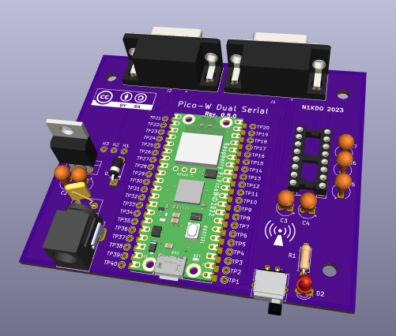
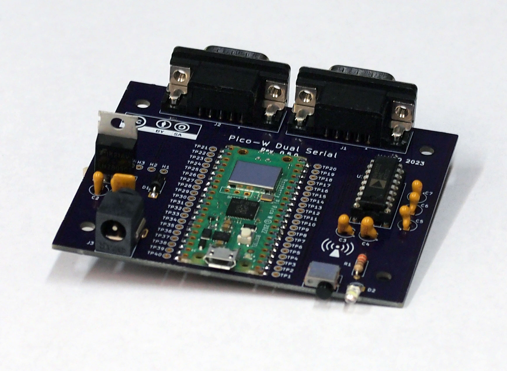

# Pico-W Dual Serial 

This is a simple board that supports two RS-232 serial ports (TXD & RXD _only_) with a
Raspberry PI Pico-W.  This is useful to internet-enable devices that support a serial 
interface.

This board is sized for a [Hammond Manufacturing 1591XXSFLBK](https://www.hammfg.com/part/1591XXSFLBK) enclosure.

## Pictures

3-D image from Kicad 

Real board!

## Schematic and Bill of Materials

[Schematic PDF](schematic.pdf)

[Bill of Materials](Bill-of-Materials.md)

## License

This work is licensed under a
[Creative Commons Attribution-ShareAlike 4.0 International License](http://creativecommons.org/licenses/by-sa/4.0/).

To view a copy of this license, visit http://creativecommons.org/licenses/by-sa/4.0/ or send a letter to Creative Commons, PO Box 1866, Mountain View, CA 94042, USA.
